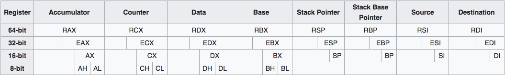

# LibftASM - Libc functions (re)coded with assembly language optimizations
## 0x01 - Install, run and debugging
### I - Install Brew, then NASM:
```
Mac:
	/usr/bin/ruby -e "$(curl -fsSL https://raw.githubusercontent.com/Homebrew/install/master/install)"
	brew install nasm
Linux:
	sudo apt-get install nasm
```
### II - Test library functions
```
bash Usage
(equivalent to 'make test & ./maintest.aout')
```

### III - Use lldb (debugger) to read registers
```
~/.lldbinit
settings set target.x86-disassembly-flavor intel
lldb a.out
b main	; break main
run
b ft_islower ;
c ; continue
s ; step
register read
register read rflags
```


## 0x02 - Computer Architecture

### I - Registers Conventions
There are 8 general purposes registers and 1 Instruction pointer.
EAX is the full 32-bit value with AX is the lower 16-bits, AL is the lower 8 bits, AH is the bits 8 through 15 (zero-based).
Arguments passed to the function are the following: 1st: rdi , 2nd: rsi, 3rd: rdx, 4th: rcx, 5th: r8, 6th: r9. If more params are passed they are stored on the Stack.

#### A - Caller-save registers (eax, ecx, edx)
Caller-saved registers (AKA volatile registers) are used to hold temporary quantities that need not be preserved across calls. For that reason, it is the caller's responsibility to push these registers onto the stack if it wants to restore this value after a procedure call.
```
EAX: Stores function return values
ECX: Counter for string and loop operation
EDX: I/O Pointer
EIP: Instruction pointer (Pointer to the next instruction to be executed)
```

#### B - Callee-save registers (ebp, ebx, esi, edi)
Callee-saved registers (AKA non-volatile registers) are used to hold long-lived values that should be preserved across calls. When the caller makes a procedure call, it can expect that those registers will hold the same value after the callee returns, making it the responsibility of the callee to save them and restore them before returning to the caller.
```
EBX: Base pointer to the data section
EDI: Source pointer for string operations
ESI: Destination pointer for string operations
ESP: Stack pointer
EBP: Stack frame base pointer (local variables in the function)
```

#### C - EFLAGS register
https://en.wikipedia.org/wiki/FLAGS_register

| Bit | Label  | Description  |
| :-----: | :-: | :-: |
| 0 | CF | Carry Flag: Set by arithmetic instructions which generate either a carry or borrow. Set when an
| 2 | PF | Parity Flag: Set by most CPU instructions if the least significant (aka the low-order bits) of the destination operand contain an even number of 1's. Not used much anymore |
| 4 | AF | Auxiliary Carry Flag: Set if there is a carry or borrow involving bit 4 of EAX. Set when a CPU instruction generates a carry to or a borrow from the low-order 4 bits of an operand. This flag is used for binary coded decimal (BCD) arithmetic. |
| 6 | ZF | Zero Flag: Set by most instructions if the result an operation is binary zero. |
| 7 | SF | Sign Flag: Most operations set this bit the same as the most significant bit (MSB) (aka high-order bit) of the result. 0 is positive, 1 is negative. id est: 0xFFFFFFFE is -2, 0xFFFFFFFF is -1 and 0x00000001 is 1. |
| 8 | TF | Trap Flag: (sometimes named a Trace Flag.) Permits single stepping of programs. After executing a single instruction, the processor generates an internal exception 1. When Trap Flag is set by a program, the processor generates a single-step interrupt after each instruction. A debugging program can use this feature to execute a program one instruction at a time. |
| 9 | IF | Interrupt Enable Flag: when set, the processor recognizes external interrupts on the INTR pin. When set, interrupts are recognized and acted on as they are received. The bit can be cleared to turn off interrupt processing temporarily. |
| 10 | DF | Direction Flag: Set and cleared using the STD and CLD instructions. It is used in string processing. When set to 1, string operations process down from high addresses to low addresses. If cleared, string operations process up from low addresses to high addresses. |
| 11 | OF | Overflow Flag: Most arithmetic instructions set this bit, indicating that the result was too large to fit in the destination. When set, it indicates that the result of an operation is too large or too small to fit in the destination operand. |
| 12-13 | IOPL | Input/Output privilege level flags: Used in protected mode to generate four levels of security. |
| 14 | NT | Nested Task Flag: Used in protected mode. When set, it indicates that one system task has invoked another via a CALL Instruction, rather than a JMP. |
| 16 | RF | Resume Flag: Used by the debug registers DR6 and DR7. It enables you to turn off certain exceptions while debugging code. |

#### D - Bigger registers
```
Registers for long double (12 octets) : xmm8 xmm9 xmm10 xmm11
```

<<<<<<< HEAD
# libftASM

Writing a lib in x86 assembly (intel flavour)

```js
;//APP (Asm Pre Processor) macros
%define MACH_SYSCALL(n)    0x2000000 | n
%define WRITE              4
%define STDOUT             1

;//data
section .data
hello:
	.string db "Hello world!", 10
	.len equ $ - hello.string

;//text symbols
section .text
	global start
	global _main

;//nasm entry point
start:
	call _main                    ;//backup instruction pointer RIP jump to _main
	ret

;//default entry point
_main:
	push rbp                      ;//backup stack frame base pointer RBP
	mov rbp, rsp                  ;//stack end pointer RSP
	sub rsp, 16                   ;//grow the stack towards lower addresses
	mov rdi, STDOUT               ;//passing parameters to the WRITE syscall...
	lea rsi, [rel hello.string]
	mov rdx, hello.len
	mov rax, MACH_SYSCALL(WRITE)  ;//RAX holds the syscall number
	syscall
	leave                         ;//set RSP to RBP, then pop RBP (pushed above)
	ret                           ;//pop RIP (pushed above in call)
```
## X86 Assembly

### General Purpose Registers



**Some registers values are preserved across function calls !**

|**Preserved Registers**|```rbx```| ```rsp```| ```rbp```| ```r12```| ```r13```| ```r14```| ```r15```|
|-|-|-|-|-|-|-|-|-|-|
| **Scratch Registers** | ```rax```| ```rdi```| ```rsi```| ```rdx```| ```rcx```| ```r8```| ```r9```| ```r10```| ```r11```|


### Noteworthy Instructions

An instruction is a statement that is executed at runtime. An x86 instruction can have zero to three operands. See the complete [list of x86 instructions](https://c9x.me/x86/).
```
instruction destination_operand, source_operand, last_operand
```

|Instruction|Black Sheep Wall|
|-----------|---------|
|```NOP```  |The one-byte NOP instruction is commonly used to align memory to speed-up jump as it is faster to jump using powers of 2|
|```push``` |Pushes an immediate (numeric constant) or the **value** contained in a register onto the Stack and automatically decrements ```rsp``` by **sizeof(value)**|
|```pop```  |Pops **value** off the stack into a register and automatically increments ```rsp``` by **sizeof(value)**|
|```syscall``` |Does wicked Kernel Magic|
|```call``` |Pushes ```rip``` onto the stack and jumps to the ```destination_operand```|
|```leave``` |Releases the current stack frame. Moves ```rbp``` to ```rsp``` and pops ```rbp``` from the stack|
|```ret``` |Pops the ```rip``` saved by ```call``` back in ```rip```|
|```mov```|Move the value of the ```source operand``` in ```destination operand```|
|```lea```|Load Effective Address of the ```source operand``` in the ```destination operand```. The ```source operand``` is a memory address (offset part) specified with one of the processors addressing modes, the ```destination operand``` is a general-purpose register|
|```jump```|Loads the ```destination operand``` in ```rip```, the ```destination operand``` specifies the address of the instruction being jumped to. This operand can be an immediate value, a general-purpose register, or a memory location|
|```and``` |Performs the following operation: ```destination operand = destination operand & source operand``` and sets some flags|
|```test```|Is basically an ```and``` instruction that does not alter the ```destination operand```|

### Pointer Directives

There are times when we need to assist assembler in translating references to data in memory. When the instruction has no reference to operand size one must use a pointer directive.

```js
mov     BYTE  [ al], 42  ; Store 8-bit   (1 byte)  value
mov     WORD  [ ax], 42  ; Store 16-bit  (2 bytes) value
mov     DWORD [eax], 42  ; Store 32-bit  (4 bytes) value
mov     QWORD [rax], 42  ; Store 64-bit  (8 bytes) value
```

## Passing function arguments

### User space ```call```

User-level applications use as integer registers for passing the sequence ```rdi```, ```rsi```, ```rdx```, ```rcx```, ```r8``` and ```r9```.

|Destination|Source   |Data     |Counter  |R8       |R9       |
|-----------|---------|---------|---------|---------|---------|
|```rdi```  |```rsi```|```rdx```|```rcx```|```r8 ```|```r9 ```|

* An user-space call is done via the ```call``` instruction.
* If more params are passed they are **stored on the Stack in reverse order**
* The register ```rax``` contains the result of the called procedure.

### Kernel space ```syscall```

The kernel interface uses ```rdi```, ```rsi```, ```rdx```, ```r10```, ```r8``` and ```r9```.

|Destination|Source   |Data     |R10      |R8       |R9      |
|-----------|---------|---------|---------|---------|--------|
|```rdi```  |```rsi```|```rdx```|```r10```|```r8 ```|```r9```|

* A system-call is done via the ```syscall``` instruction.
* This clobbers ```rcx``` and ```r11```, as well as ```rax```, but other registers are preserved.
* The number of the syscall has to be passed in register ```rax```.
* System-calls are limited to six arguments, no argument is passed directly on the stack.
* Returning from the syscall, register ```rax``` contains the result of the system-call.
* A value in the range between ```-4095``` and ```-1``` indicates an **error**, it is ```-errno```.
* Only values of class INTEGER or class MEMORY are passed to the kernel.

## Miscelleaneous links (MUST READ / SEE)
=======
## 0x03 - The Stack
The stack grows toward lower memory addresses. Hence the top of the Stack is the lowest numerical address. ESP point to the data that has been used at the top of the stack.
The stack keeps track of which functions were called before the current one, it holds local variables and is frequently used to pass arguments to the next function to be called.


## 0x04 - Computer Instructions
NOP: The one-byte NOP instruction is in fact an alias mnemonic for the XCHG AX, AX instruction. It is commonly used to align memory to speed-up jump as it is faster to jump using powers of 2.</br>
PUSH: Will push Word (4 bytes), Doubleword (8 bytes) or Quadword (16 bytes) onto the Stack. It can be either an immediate (numeric constant) or the value contained in a register.</br>
The push instruction automatically decrements ESP, the stack pointer, by 4.</br>
CALL: It transfers control to a different function in a way that control can later be resumed where it left off. First it pushes the address of the next instruction onto the stack for use by RET when the function is done.</br>
RET: It pops the top of the stack into EIP register.</br>
MOV: Assign a value from a register, memory or immediate to a register or memory. It can't from memory to memory.</br>
```
mov eax, ecx    ; move the value contained in ECX register to EAX, i,e : eax = ecx
```
MOVZX: move a value to bigger container and fill it will the value and 0 for the remaining bits.
```
movzx eax, al   ; move al to eax and fill it with 0
```
LEA: Copy memory address
```
lea rax, [rsi]  ; copy memory address from rsi to rax;
```
TEST: is basically an AND instruction that does not alter the dest.
```
test edx, edx is faster than cmp edx 0, it sets the zero flag to 1 if edx is null, else to 0
```
MOVNTDQ : mov DQ (Double Quadword which means 2 x 4 x 2 = 16 octets = 128 bits) in the source operand (second operand) to the destination operand (first operand) using a non-temporal hint to prevent caching of the data during the write to memory.


## 0x05 - Must-Read and Must-Watch links

Please read very interesting PDFs in the resources folder of this git

* About [Calling conventions](https://stackoverflow.com/questions/2535989/what-are-the-calling-conventions-for-unix-linux-system-calls-on-i386-and-x86-6)(https://en.wikipedia.org/wiki/X86_calling_conventions)
* [Great video about compilers & asm](https://img.youtube.com/vi/bSkpMdDe4g4/0.jpg)](https://www.youtube.com/watch?v=bSkpMdDe4g4)
* Or the [System V ABI](https://wiki.osdev.org/System_V_ABI)
* [List of x86 instructions](https://c9x.me/x86/)
* All the [XNU syscalls](https://opensource.apple.com/source/xnu/xnu-1504.3.12/bsd/kern/syscalls.master)
* More on [X86_Architecture](https://en.wikibooks.org/wiki/X86_Assembly/X86_Architecture)
* Try out the [Compiler explorer](https://godbolt.org/)
* Agner's [Optimization](http://agner.org/optimize/)
* About [loops](https://stackoverflow.com/questions/47783926/why-are-loops-always-compiled-like-this)


## 0x06 - Debugging
```
lldb maintest.out
disas -n loop
break memoryaddress
run
step
register read
exit
```
